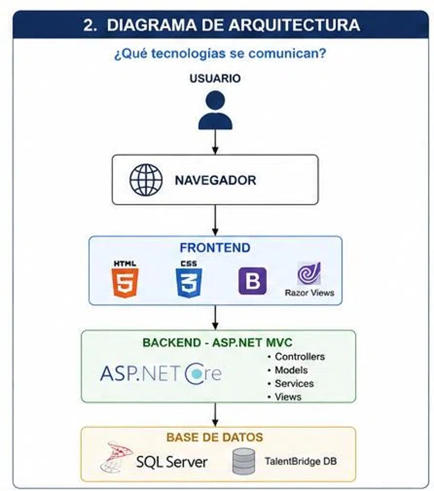
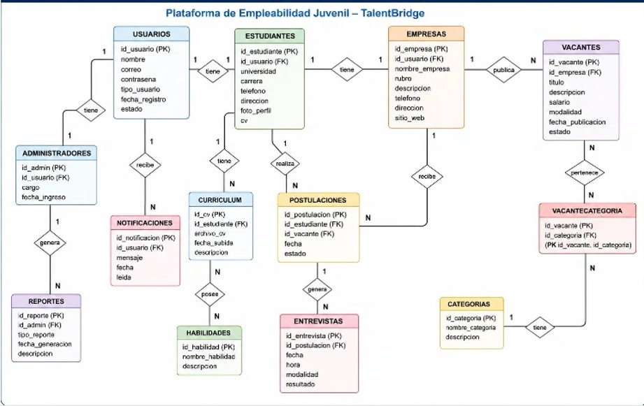
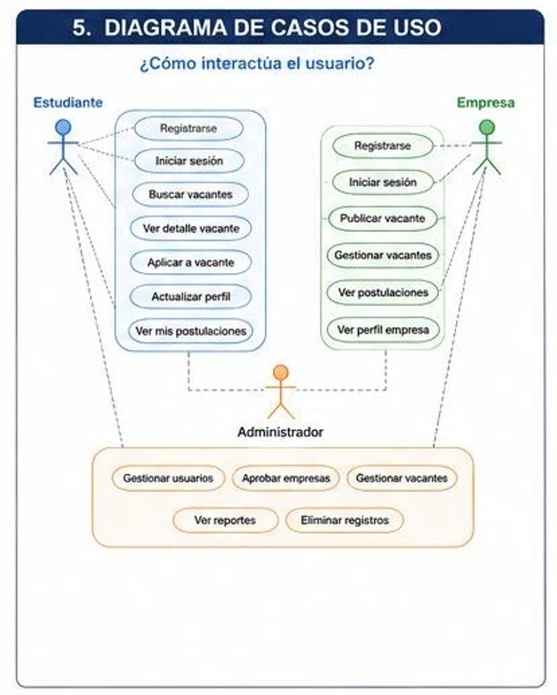
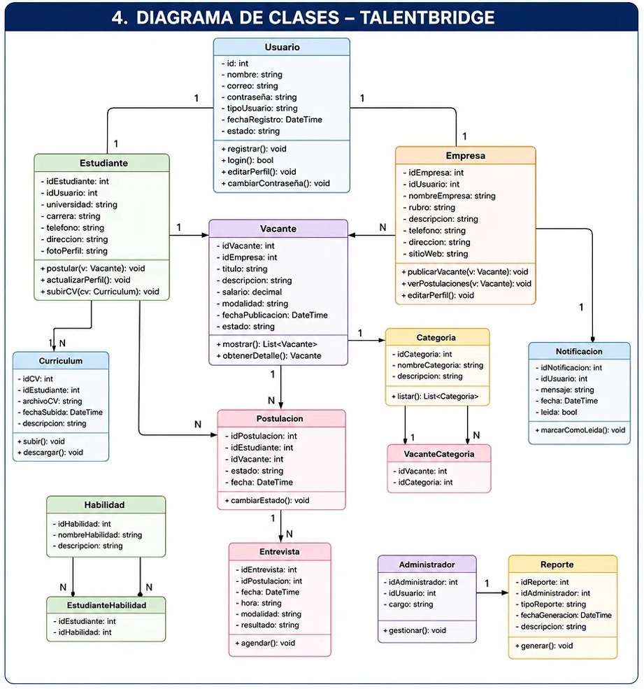
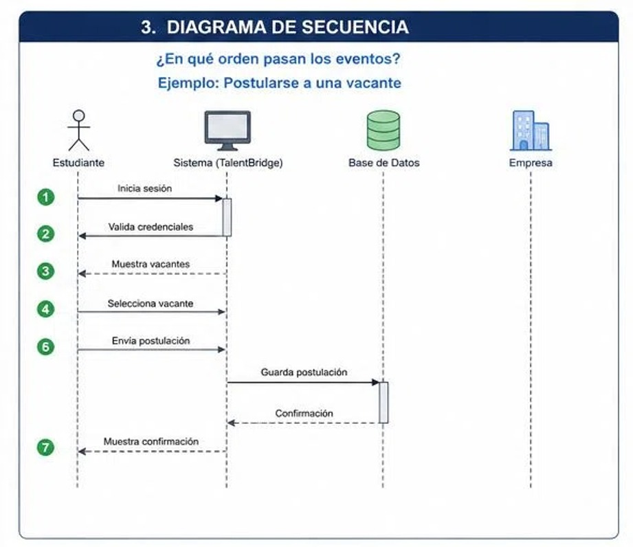

# Manual Técnico - Arquitectura y Diagramas (TalentBridge)

## 1. Arquitectura General del Sistema

El sistema **TalentBridge** está construido bajo un modelo de arquitectura desacoplada Cliente-Servidor basado en servicios RESTful. La comunicación entre la interfaz de usuario y el servidor se realiza mediante peticiones HTTP en formato JSON.

### Diagrama de Arquitectura
Representa la separación de capas entre el Frontend (interfaz de usuario), el Backend (lógica de negocio y APIs) y la Base de Datos.

---

## 2. Diagramas del Sistema

A continuación se presentan los modelos conceptuales y de diseño que componen la estructura lógica del software:

### Diagrama General del Sistema
Muestra una visión global del flujo de datos y componentes integrados dentro de la plataforma TalentBridge.

---

### Diagrama de Casos de Uso
Define los actores principales (Estudiante y Empresa) y las interacciones que pueden realizar dentro de la plataforma, como registrarse, postularse, publicar vacantes y programar entrevistas.

---

### Diagrama de Clases
Muestra las entidades principales del sistema (`Usuario`, `Estudiante`, `Empresa`, `Vacante`, `Postulacion`, `Entrevista`), junto con sus atributos, métodos y las relaciones entre cada una de ellas.

---

### Diagrama de Secuencia
Ilustra la interacción temporal y el intercambio de mensajes entre el usuario, el sistema y la base de datos durante el proceso de postulación a una vacante y agendamiento de entrevista.

---

## 3. Modelo y Diccionario de Base de Datos

### Tabla: `usuarios`
Almacena las credenciales de acceso y el tipo de rol asignado.

| Campo | Tipo de Dato | Restricciones | Descripción |
| :--- | :--- | :--- | :--- |
| `id` | INT / BIGINT | PRIMARY KEY, AUTO_INCREMENT | Identificador único del usuario |
| `nombre_completo` | VARCHAR(150) | NOT NULL | Nombre de la persona o empresa |
| `correo` | VARCHAR(150) | NOT NULL, UNIQUE | Correo electrónico registrado |
| `password` | VARCHAR(255) | NOT NULL | Hash de la contraseña |
| `tipo_usuario` | ENUM('estudiante', 'empresa') | NOT NULL | Rol asignado |

---

### Tabla: `perfil_estudiante`
Contiene la información académica, habilidades y referencia al CV del estudiante.

| Campo | Tipo de Dato | Restricciones | Descripción |
| :--- | :--- | :--- | :--- |
| `id` | INT / BIGINT | PRIMARY KEY, AUTO_INCREMENT | ID del perfil estudiante |
| `usuario_id` | INT / BIGINT | FOREIGN KEY (`usuarios.id`) | ID de usuario asociado |
| `universidad` | VARCHAR(150) | NULLABLE | Institución académica |
| `carrera` | VARCHAR(150) | NULLABLE | Carrera universitaria |
| `semestre` | VARCHAR(50) | NULLABLE | Semestre o nivel |
| `habilidades_tecnicas`| TEXT | NULLABLE | Lista de habilidades técnicas |
| `cv_url` | VARCHAR(255) | NULLABLE | Ruta del archivo CV subido |

---

### Tabla: `perfil_empresa`
Guarda el detalle comercial e información de contacto corporativo.

| Campo | Tipo de Dato | Restricciones | Descripción |
| :--- | :--- | :--- | :--- |
| `id` | INT / BIGINT | PRIMARY KEY, AUTO_INCREMENT | ID del perfil empresa |
| `usuario_id` | INT / BIGINT | FOREIGN KEY (`usuarios.id`) | ID de usuario asociado |
| `nombre_empresa` | VARCHAR(150) | NOT NULL | Razon social / Nombre comercial |
| `sector` | VARCHAR(100) | NULLABLE | Industria o rubro |
| `email_contacto` | VARCHAR(150) | NULLABLE | Correo corporativo de contacto |
| `telefono` | VARCHAR(20) | NULLABLE | Teléfono corporativo |

---

### Tabla: `vacantes`
Guarda el detalle de las ofertas laborales publicadas.

| Campo | Tipo de Dato | Restricciones | Descripción |
| :--- | :--- | :--- | :--- |
| `id` | INT / BIGINT | PRIMARY KEY, AUTO_INCREMENT | ID de la vacante |
| `empresa_id` | INT / BIGINT | FOREIGN KEY (`perfil_empresa.id`)| Empresa que publica |
| `titulo` | VARCHAR(150) | NOT NULL | Título del puesto laboral |
| `descripcion` | TEXT | NOT NULL | Descripción de funciones |
| `requisitos` | TEXT | NOT NULL | Habilidades requeridas |
| `modalidad` | VARCHAR(50) | NOT NULL | Presencial, Remoto o Híbrido |
| `salario_minimo` | DECIMAL(10,2) | NULLABLE | Rango mínimo |
| `salario_maximo` | DECIMAL(10,2) | NULLABLE | Rango máximo |

---

### Tabla: `postulaciones`
Registra el interés de un estudiante en una vacante.

| Campo | Tipo de Dato | Restricciones | Descripción |
| :--- | :--- | :--- | :--- |
| `id` | INT / BIGINT | PRIMARY KEY, AUTO_INCREMENT | ID de la postulación |
| `vacante_id` | INT / BIGINT | FOREIGN KEY (`vacantes.id`) | Vacante postulada |
| `estudiante_id` | INT / BIGINT | FOREIGN KEY (`perfil_estudiante.id`)| Estudiante postulante |
| `fecha_postulacion`| TIMESTAMP | DEFAULT CURRENT_TIMESTAMP | Fecha del registro |

---

### Tabla: `entrevistas`
Gestiona la programación de citas de evaluación entre la empresa y los estudiantes.

| Campo | Tipo de Dato | Restricciones | Descripción |
| :--- | :--- | :--- | :--- |
| `id` | INT / BIGINT | PRIMARY KEY, AUTO_INCREMENT | ID de la entrevista |
| `postulacion_id` | INT / BIGINT | FOREIGN KEY (`postulaciones.id`) | Aplicación asociada |
| `fecha_hora` | DATETIME | NOT NULL | Cita agendada |
| `duracion_minutos`| INT | DEFAULT 60 | Duración en minutos |
| `ubicacion_enlace` | VARCHAR(255) | NOT NULL | Enlace de videollamada o sede |

---

## 4. Endpoints y APIs Principales

* **`POST /api/auth/register`**: Registro de usuarios.
* **`POST /api/auth/login`**: Autenticación e inicio de sesión.
* **`GET /api/vacantes`**: Consulta de ofertas laborales disponibles.
* **`POST /api/vacantes`**: Publicación de nueva oferta por la empresa.
* **`POST /api/postulaciones`**: Aplicación de estudiante a una vacante.
* **`POST /api/entrevistas`**: Agendamiento de entrevista con un candidato.
