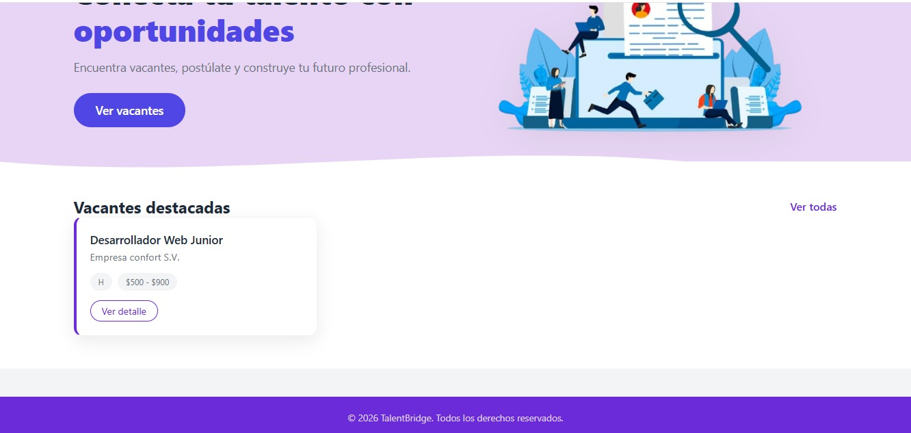
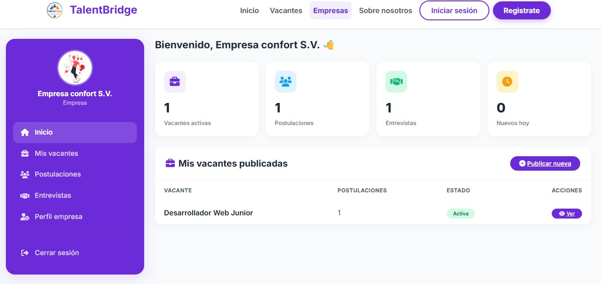
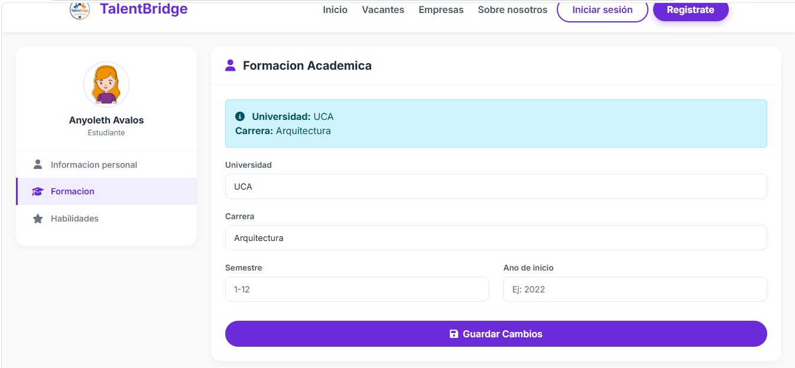
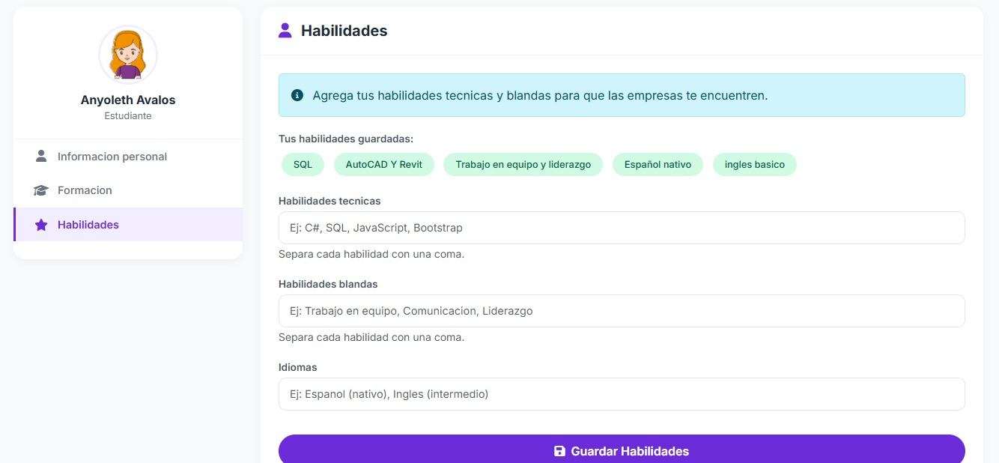
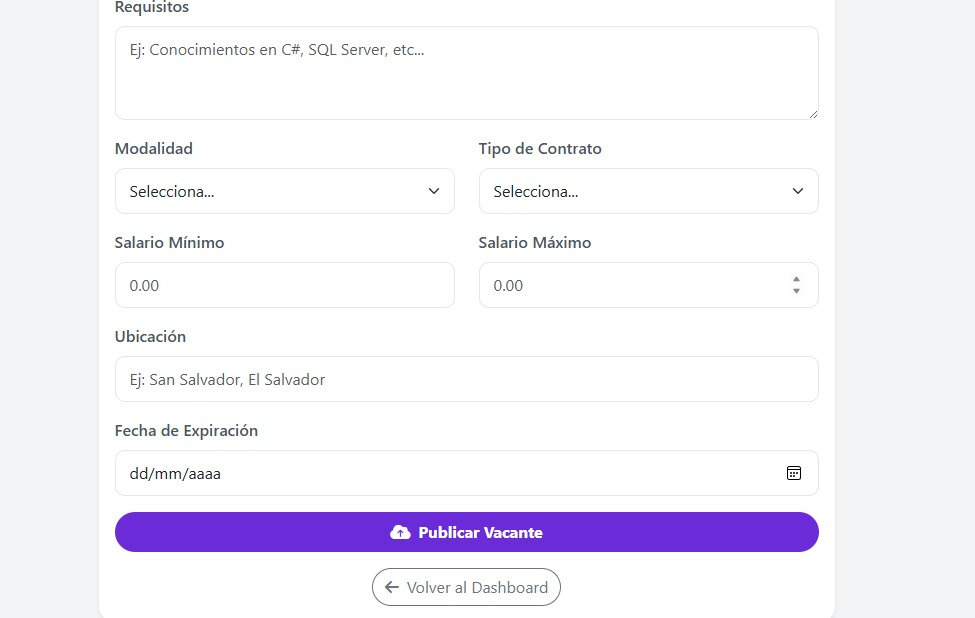
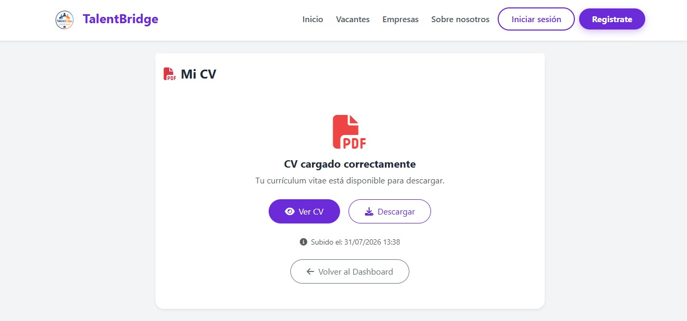
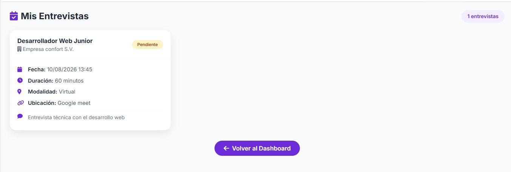
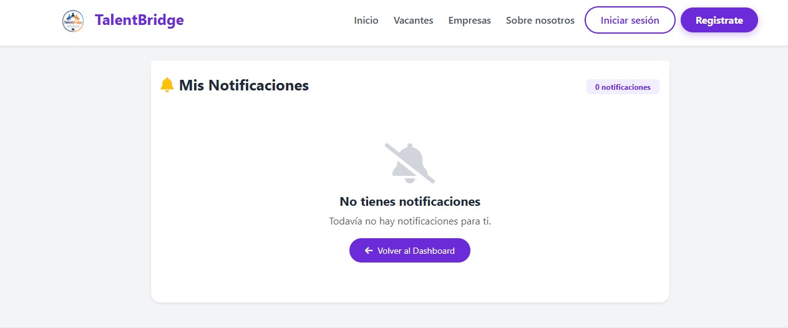

# Manual de Usuario - TalentBridge

## ¿Qué es TalentBridge?

**TalentBridge** es una plataforma web diseñada para facilitar la conexión entre jóvenes talentos, estudiantes y recién graduados con empresas que ofrecen oportunidades de empleo, pasantías y prácticas profesionales.

El sistema tiene como propósito reducir las dificultades que enfrentan muchos jóvenes al momento de incorporarse al ámbito laboral, brindando un espacio digital donde puedan crear perfiles profesionales, registrar sus habilidades, explorar vacantes disponibles y postularse de forma rápida y organizada.

Por su parte, las empresas podrán registrarse en la plataforma para publicar ofertas laborales, gestionar postulaciones y encontrar candidatos que se ajusten a los perfiles requeridos.

La plataforma cuenta con módulos especializados para estudiantes, empresas y administradores, permitiendo una gestión eficiente de usuarios, vacantes, postulaciones, notificaciones y seguimiento del proceso de selección[cite: 1].

---

## Misión y Visión

### Misión
Brindar una plataforma digital innovadora que conecte a jóvenes talentos con oportunidades laborales, prácticas profesionales y pasantías, facilitando la interacción entre estudiantes y empresas mediante un sistema accesible, eficiente y confiable que impulse el desarrollo profesional[cite: 1].

### Visión
Ser la plataforma líder en conexión laboral juvenil, reconocida por impulsar el crecimiento profesional de nuevas generaciones, facilitando el acceso a oportunidades de empleo y contribuyendo al desarrollo del talento humano en un entorno tecnológico e inclusivo[cite: 1].

---

## Objetivos del Sistema

### Objetivo General
Desarrollar una plataforma web que facilite la conexión entre jóvenes y empresas[cite: 1].

### Objetivos Específicos
* Diseñar un sistema de registro para estudiantes y empresas[cite: 1].
* Implementar publicación y postulación a vacantes[cite: 1].
* Gestionar seguimiento de aplicaciones[cite: 1].

---

## Guía de Uso del Sistema (Paso a Paso)

### 1. Inicio Público y Exploración de Vacantes
Cuando ingresamos a TalentBridge, se presenta la pantalla principal donde los visitantes pueden explorar las vacantes destacadas y conocer la plataforma[cite: 1].

---

### 2. Autenticación y Registro de Usuarios
En la barra superior de navegación se encuentran los botones para **Iniciar sesión** y **Registrarse**[cite: 1]. En el proceso de registro o inicio de sesión, el sistema permite elegir entre dos tipos de usuario: **Estudiante** o **Empresa**[cite: 1].

*Variante de pantalla de inicio de sesión / registro:*  

---

### 3. Pantalla Principal en Sesión (Dashboard)

Una vez iniciada la sesión, la plataforma muestra la página principal personalizada según el perfil autenticado[cite: 1].

#### Dashboard del Estudiante
Muestra un panel interactivo con resumen de postulaciones, entrevistas agendadas, vacantes guardadas, notificaciones y las vacantes recomendadas[cite: 1].

#### Dashboard de la Empresa
Permite visualizar un resumen de las vacantes activas, postulaciones recibidas, entrevistas programadas y la lista de vacantes publicadas[cite: 1].

---

### 4. Configuración del Perfil del Estudiante

En el apartado de estudiante se encuentran secciones clave para que las empresas puedan conocer más del candidato antes de agendar una entrevista[cite: 1]:

#### Descripción Personal e Información Básica
Sección donde el estudiante gestiona sus datos personales y biografía profesional[cite: 1].

#### Formación Académica
Permite registrar la universidad, carrera, semestre actual y año de inicio[cite: 1].

#### Habilidades y Competencias
En este módulo el estudiante puede agregar habilidades técnicas (ej. C#, SQL, JavaScript), habilidades blandas y dominio de idiomas[cite: 1].

---

### 5. Búsqueda y Postulación a Vacantes

Teniendo el perfil completo, el estudiante puede explorar y filtrar las vacantes disponibles por palabra clave, categoría, modalidad y rango salarial[cite: 1].

Al seleccionar una oferta, se despliega el detalle con la información de la empresa y los requisitos de la vacante[cite: 1]. Para completar la solicitud de empleo, el usuario debe cargar previamente su currículum vitae[cite: 1].

#### Módulo Mi CV
Espacio donde el usuario sube y gestiona su currículum en formato PDF para adjuntarlo a las postulaciones[cite: 1].

---

### 6. Funcionalidades del Módulo Empresa

#### Publicación de Vacantes
Estando en sesión como empresa, se pueden publicar nuevas ofertas laborales completando el título, descripción, requisitos, modalidad, tipo de contrato, rango salarial y fecha de expiración[cite: 1].

#### Información Corporativa
Módulo para configurar el perfil de la empresa, logo, sector, descripción comercial y canales de contacto[cite: 1].

#### Programación de Entrevistas
Cuando una empresa recibe un postulante y revisa su currículum, si está interesada, puede programar una entrevista asignando fecha, hora, duración, modalidad y enlace de reunión (Google Meet, Zoom, etc.)[cite: 1].

---

### 7. Notificaciones y Seguimiento

Una vez enviada una postulación o programada una entrevista, los usuarios pueden estar pendientes del estado de su proceso mediante el panel de notificaciones[cite: 1].

